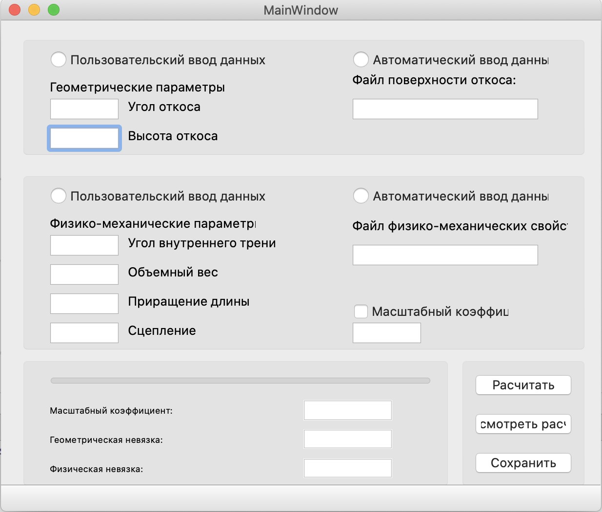
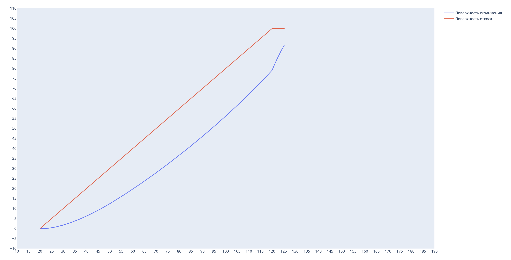

# Slope-Force

Description a application

## UI

## Tutorial

Приложение для построения откоса карьера, 
для понимания примерной зоны обрушения и как будет происходить само разрушение горный породы

## Result

Примерный результат вы можете видеть на данном изобрежения, красной линией изобрежена
линия откоса, синия линия - это линия по которой будет происходить обрушение откоса

### Did this work

* <a href="https://vk.com/wismut83">Иван Гузеев</a>
* <a href="https://vk.com/artshelom">Артем Шеломенцев</a>
* Под руководством: Жабко Андрей Викторович
